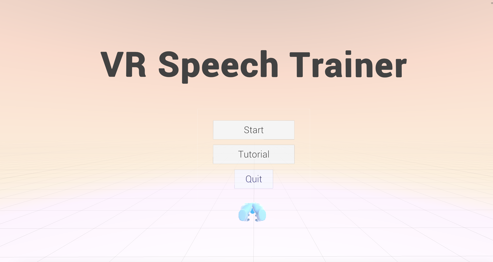
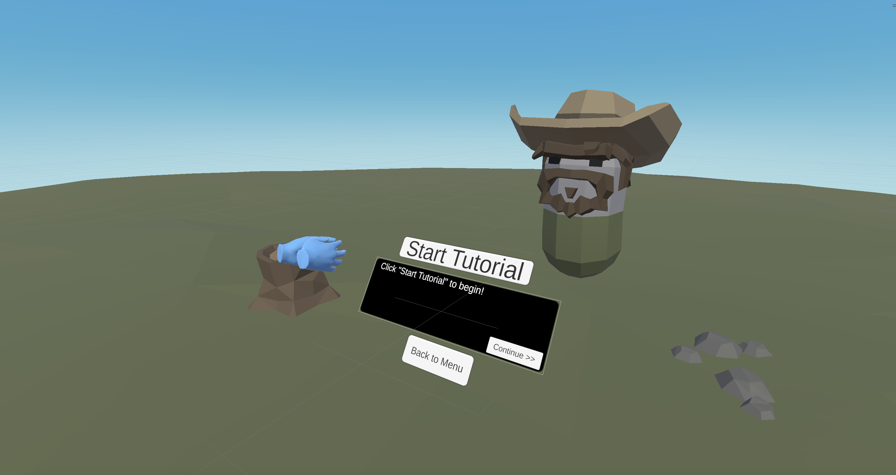
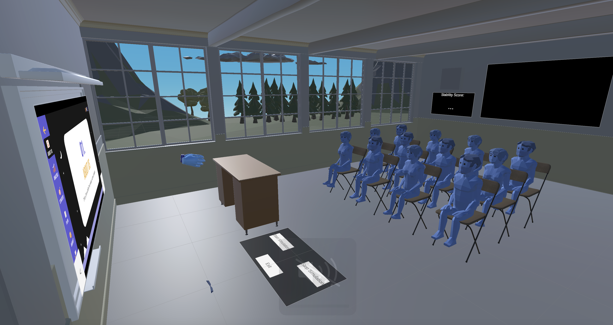

# VSpeech

## Introduction
VSpeech is a Virtual Reality app build for the Meta Quest 2 / 3. It was developed in a little under 2 months as part of a College project for Design Thinking In Technology at Purdue University.

## Executive Summary

The Global Challenge that our group decided to work on was to Enhance VR. Our group decided to tackle the challenge of creating a VR application that could help a specific user group overcome certain obstacles in their lives. As a group, we noticed that VR was becoming more readily available for the average consumer, but that people still viewed them largely as a gaming device.

This prototype was completely constructed in Unity. Our group utilized tutorial resources found on the internet to learn how to develop this application. Developing this prototype was a difficult process, and as a result, our group had to forgo certain features that we wanted to add to our prototype. In the end, we were able to incorporate a timer feature, a working powerpoint, an introductory tutorial, a motion tracking score, and an interactive practice environment. 

## Developers
VSpeech was developed by:

* Myiesha Zaman
* Dillon Michlena
* Drew Tobias
* Seth Badics
* Dominic Picciolo

## Screenshots

Main Menu Area

Tutorial Area

Classroom Practice Area
